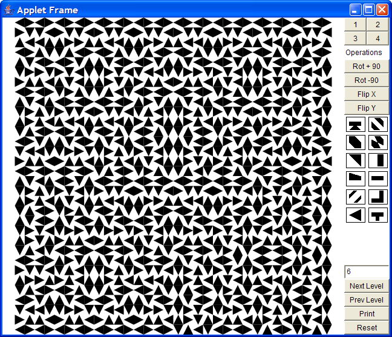

fractal-tile
============

Creates fractal tiling patterns

This is a simple program that draws fractal tiling patterns. The idea came from the Mathematical Recreations article in May 2000 Scientific American. The idea is that their are four quadrants of a square. Each square has a simple transformation made of rotations and flips. In each square a tillable shape is draw. To proceed to the next level of tiling the four quadrant square is moved to each of the quadrants applying the transformation for each of the quadrants. This is done for several levels until a complex pattern emerges.

To edit the process select the button for the quadrant you want to edit and then press the button for the operation you want to apply. To change the shape click the shape.

